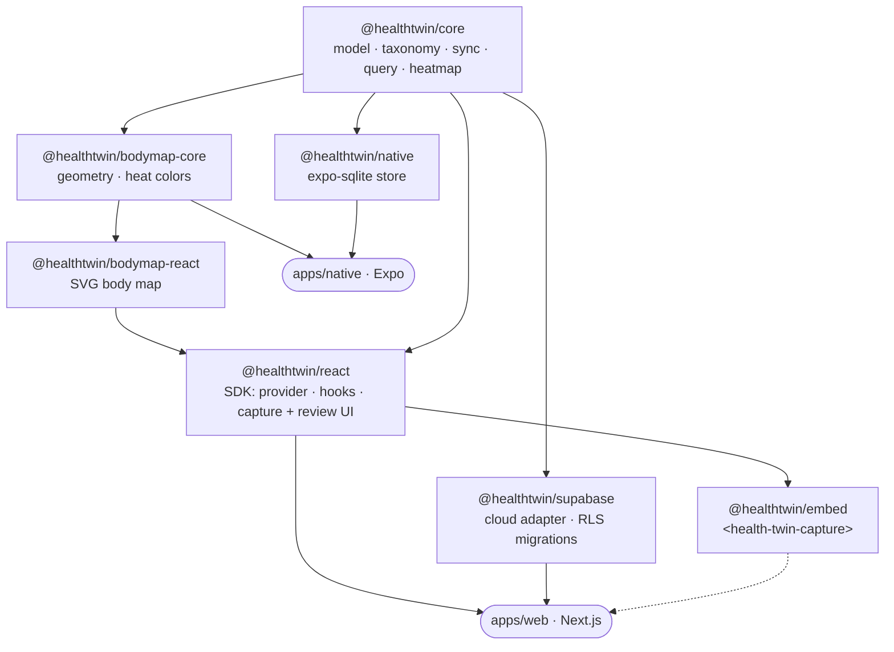

<div align="center">

# 🧍 HealthTwin

**An embeddable human digital twin for health.**

Tap where it hurts. Note what you feel. Build a living, longitudinal record of your body —
usable as your own app *and* as an SDK that clinics and fitness platforms embed.

[](LICENSE)


</div>

---

## What it is

Every symptom checker treats the body map as a throwaway triage widget. HealthTwin treats it
as a **persistent record** that accumulates over time — so a physiotherapist, doctor, or the
person themselves can look back and see *what actually happened this week*: where it hurt, how
intensely, when, and in what context ("sore after PT," "worse in the mornings").

- 🧍 **Body-map capture** — tap a region on a 2D anatomical map, log type · quality · 0–10 intensity · note · time · context.
- 🔥 **Review** — a **heatmap** (by frequency / mean intensity / recency) and a day-grouped **timeline**.
- 📴 **Local-first** — capture works offline; syncs through a pluggable backend when online.
- 🔒 **Security-first** — encrypted-at-rest + Postgres Row-Level Security, consent-based sharing, audit log.
- 🧩 **Embeddable** — drop `<health-twin-capture>` into any partner app; keep the data in *their* backend if they want.
- 📱 **Web + native** — one shared body-map geometry renders on the web (SVG) and native (react-native-svg).

## Quickstart

```bash
pnpm install
pnpm -w test                        # ~49 unit tests + build across all packages
pnpm --filter @healthtwin/web dev   # open http://localhost:3000
```

Then: tap a region → log a symptom → it persists (IndexedDB) across reloads → open **/review**
to see the heatmap + timeline.

## Architecture

A `pnpm` + Turborepo monorepo. The body map's *brain* (geometry, hit-testing, math) lives in a
pure, headless core; each platform only re-implements the *pixels*.



| Package | Responsibility |
|---|---|
| [`@healthtwin/core`](packages/core) | Immutable `Observation` model, versioned anatomy taxonomy, Zod validation, query, **heatmap/timeline aggregation**, **sync engine** — zero UI deps |
| [`@healthtwin/bodymap-core`](packages/bodymap-core) | Headless SVG region geometry, hit-testing, heat color math |
| [`@healthtwin/bodymap-react`](packages/bodymap-react) | Accessible SVG `<BodyMap>` (capture + heatmap shading) |
| [`@healthtwin/react`](packages/react) | Web SDK: `HealthTwinProvider`, `useObservations`, `BodyMapCapture`, `BodyMapReview`, `Timeline`, IndexedDB store + sync-meta |
| [`@healthtwin/supabase`](packages/supabase) | Reference cloud `SyncAdapter` + auth + RLS / consent / audit SQL migrations |
| [`@healthtwin/native`](packages/native) | React Native / Expo `SqliteStore` over a testable `SqlDb` seam |
| [`@healthtwin/embed`](packages/embed) | Framework-agnostic web component + partner token exchange |
| [`apps/web`](apps/web) | Next.js app — capture + `/review` |
| [`apps/native`](apps/native) | Expo scaffold (excluded from the default workspace) |

## Using the SDK

### In a React app

```tsx
import { HealthTwinProvider, BodyMapCapture, BodyMapReview, Timeline, createIdbStore } from "@healthtwin/react";

<HealthTwinProvider store={createIdbStore()} subjectId={userId} origin="my-app">
  <BodyMapCapture view="anterior" />   {/* tap → log */}
  <BodyMapReview view="anterior" />    {/* heatmap */}
  <Timeline />                         {/* day-grouped history */}
</HealthTwinProvider>
```

### In any app (no React required)

```html
<script type="module">
  import { defineHealthTwinCapture } from "@healthtwin/embed";
  defineHealthTwinCapture();
</script>

<health-twin-capture view="anterior" subject-id="partner-user-123"></health-twin-capture>

<script>
  // Every capture is emitted here — persist it in YOUR backend to stay the data controller.
  document.querySelector("health-twin-capture")
    .addEventListener("healthtwin:observation", (e) => console.log(e.detail));
</script>
```

## The data model

One capture = one **immutable** `Observation`. Edits and deletes append a *new* record
(supersede / tombstone), so sync is conflict-free and the full clinical history is preserved.

```ts
type Observation = {
  id: ULID;
  subjectId: ID;
  occurredAt: ISO;                 // when it was felt (editable)
  createdAt: ISO;
  location: { regionId: string; side: "left" | "right" | "central";
              view: "anterior" | "posterior"; point?: { x: number; y: number } };
  type: "pain" | "stiffness" | "numbness" | "tingling" | "swelling" | "weakness" | "other";
  quality?: Quality[];             // sharp | dull | burning | throbbing | ...
  intensity?: number;              // 0–10
  note?: string;
  contextTags?: string[];          // "after-PT", "morning", ...
  taxonomyVersion: string;
  supersedes?: ULID;               // an edit points at the record it replaces
  tombstone?: boolean;             // a delete is also a new record
  origin: ID;
};
```

## Security & privacy

- **Owner-only by default** — Postgres RLS: `subject_id = auth.uid()`.
- **Immutable** — no update/delete policies; history is append-only.
- **Consent-based sharing** — `consent_grants` are scoped, time-boxed, and revocable (share is a grant, never a copy).
- **Audit** — every insert is logged.
- **Bring-your-own-backend** — the pluggable `SyncAdapter` (or the embed's capture events) lets a partner keep PHI entirely in their own system.

See [`packages/supabase`](packages/supabase) for the SQL and the honest trade-offs.

## Going live with Supabase

```bash
# apply the schema (SQL editor, or supabase db push against a linked project)
#   packages/supabase/schema.sql
# then, for apps/web:
echo "NEXT_PUBLIC_SUPABASE_URL=..."       >> apps/web/.env.local
echo "NEXT_PUBLIC_SUPABASE_ANON_KEY=..."  >> apps/web/.env.local
```

The web app runs local-first with no env, and switches to cloud (magic-link sign-in) when those
variables are present.

## Status & roadmap

Built and tested in five phases:

| Phase | Scope | State |
|---|---|---|
| 1 | Local-first web capture | ✅ |
| 2 | Sync engine + Supabase adapter + RLS | ✅ *(apply schema to run live)* |
| 3 | Review surfaces (heatmap + timeline) | ✅ |
| 4 | Native (Expo) data layer + scaffold | ✅ *(needs a simulator to run)* |
| 5 | Partner embed (web component) | ✅ |

> ⚠️ Body-map regions are **placeholder rectangles** — swap in licensed anatomical SVG art
> before shipping to real users. See `WHATS-MISSING.md` for the full gap list.

## Testing

```bash
pnpm -w test                          # unit + build (Vitest + Turborepo)
pnpm --filter @healthtwin/web e2e     # Playwright (capture + review flows)
```

Highlights: TDD throughout, `axe` accessibility assertions on the body map, RLS-shaped contract
tests for the cloud adapter, and E2E that drove out real bugs the unit tests missed.

## Contributing

Issues and PRs welcome. Run `pnpm -w test` before pushing; follow the existing TDD + focused-file
conventions. The design specs and phase plans live in [`docs/superpowers`](docs/superpowers).

## License

Licensed under the [Apache License 2.0](LICENSE) — **open-core**: the SDK is free to adopt; the
hosted backend, AI processing, and compliance tooling are the commercial product.

Copyright 2026 Fathy Shalaby.
